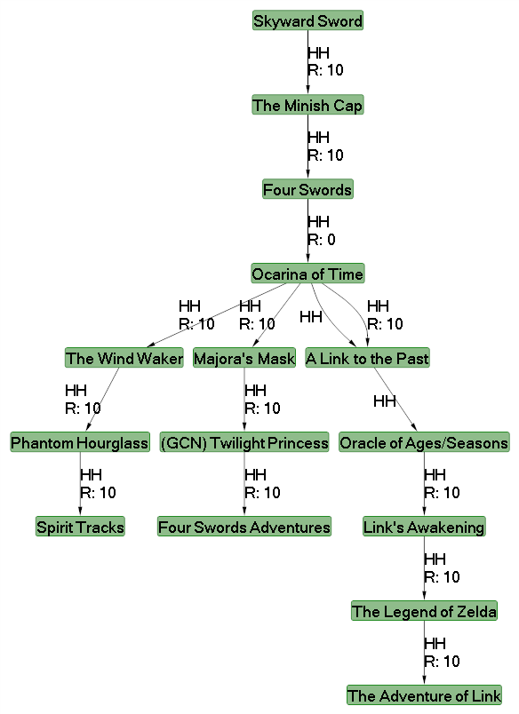

# ZeldaTimelineGenerator
Application that uses a tree graph generating utility (MSAGL)
and user specified attributes to create the closest representation of the data in a graph.

# Usage
Select the games you want to include in the initial menu from the drop downs. 
For each game, you can define both Direct Connections and Exclusions.

A copy of my LocalData.json has been included in the root of the directory. The program reads output
JSON files to save locally created data. If you would like to use the one provided (which outputs
the Hyrule Historia timeline), simply drop the file into the same folder as the 
executable. (that file is based off of the Hyrule Historia setting)

# Direct Connections
They are (at the moment) used to define the connection between games. Intended use:
Creating a connection for a game implies that game is the parent, and the specified game
is the child. The Direct Connection attribute is meant as a "strong", direct connection
between two games. Essentially an override to the exclusions.

# Exclusions
Intended use: These will be used as a modifier to the Tree building algorithm, by calling
into question the linear direction of the games, and allow multiple graphs to be generated 
by each data set. Right now, they operate in the same way as cirect connections do, though
exclusions are bidirectional while direct connections are not.

# Plans
The next step is to use the exclusion attributes and the weight of those values to generate 
"nearest-accurate representation", and eventually multiple variations per run.

Beyond that, I'd like to make the enum values importable, so it can be used in a general
sense for whatever movie/TV show/Game/Book that you would like to see "what-ifs?" for.

